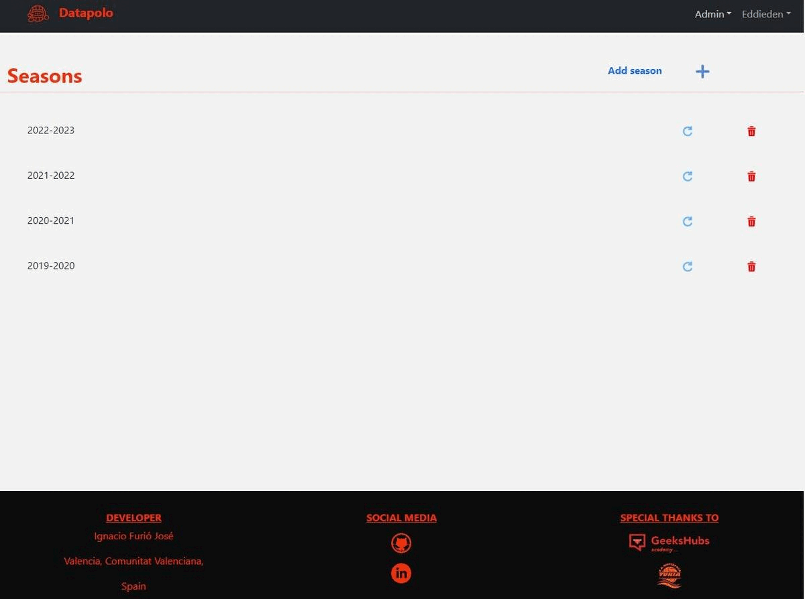
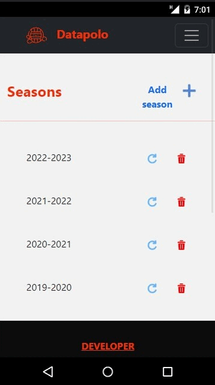

# Welcome to my frontend app  

<details>
  <summary>Contenido 📝</summary>
  <ol>
    <li><a href="#objetivo-🎯">Objetivo</a></li>
    <li><a href="#sobre-el-proyecto-🔎">Sobre el proyecto</a></li>
    <li><a href="#deploy-🚀">Deploy</a></li>
    <li><a href="#stack">Stack</a></li>
    <li><a href="#instalación-en-local">Instalación</a></li>
    <li><a href="#vistas">Vistas</a></li>
    <li><a href="#futuras-funcionalidades">Futuras funcionalidades</a></li>
    <li><a href="#contribuciones">Contribuciones</a></li>
    <li><a href="#licencia">Licencia</a></li>
    <li><a href="#webgrafia">Webgrafia</a></li>
    <li><a href="#desarrollo">Desarrollo</a></li>
    <li><a href="#agradecimientos">Agradecimientos</a></li>
    <li><a href="#contacto">Contacto</a></li>
  </ol>
</details>

---

## Objetivo 🎯

---
This project belongs to the last one made for GeekHubs Academy and the goal is to make a FullStack aplication that connects with an API to show the information needed bnby the user throught React.

---

## Sobre el proyecto 🔎

---

As a waterpolo coach I had to analyze every match my teams play carfully, so i could find ways to improve the performance for the future games. Doing that by pen and paper it's really tedious, because it's an easy way to lose information for good, and moreover, every time the data changes, the calculations must be re-done.

So I though, maybe there's a way to make this easy, and that is how i came with the idea for this project.   
  
---
## Deploy 🚀
---
<div align="center">
    <a href="https://master.d3axn9txrlwi1i.amplifyapp.com/"><strong>URL to Datapolo webpage  </strong></a>🚀🚀🚀
</div>

---

## Stack

---

<div align="center">
<a href="https://www.reactjs.com/">
    
</a>
<a href="https://reactrouter.com/en/main">
    
</a>
<a href="https://es.redux.js.org/">
    
</a>
<a href="https://developer.mozilla.org/es/docs/Web/JavaScript">
    
</a>
<a href="https://getbootstrap.com/">
    
</a>
<a href="https://aws.amazon.com/es/?nc2=h_lg">
    
</a>
<a href="https://www.adobe.com/es/products/photoshop/landpb.html?gclid=Cj0KCQjwsIejBhDOARIsANYqkD25rOS596fBY-rwSPIdUWW2E5eT4baf7l63Gv1aw2uMMv7nulEawBcaAuh8EALw_wcB&mv=search&s_kwcid=AL!3085!3!441887029672!e!!g!!adobe%20photoshop!1445901735!56657232416&mv=search&sdid=LZ32SYVR&ef_id=Cj0KCQjwsIejBhDOARIsANYqkD25rOS596fBY-rwSPIdUWW2E5eT4baf7l63Gv1aw2uMMv7nulEawBcaAuh8EALw_wcB:G:s&s_kwcid=AL!3085!3!441887029672!e!!g!!adobe%20photoshop!1445901735!56657232416&gad=1">
    
</a>
 </div>

---
## Instalación en local
---
1. Clone the repository.
2. Command to install the dependences: ` $ npm install `
3. Command to run the aplication in local: ` $ npm run dev `
4. Connect with your API at apicalls.js: ` const root = {'yourapi/endpoint'} `

---
## Vistas
---

Web view:

  

Responsive view:



---
## Futuras funcionalidades
---

[ ] Defensive stadistics
[ ] Trophies won
[ ] Search filters at players and teams
[ ] ...

---
## Contribuciones
---

Advices and feedback are always welcome. 

These are some ways you may do it:

1. Open an issue
2. Fork the repository
    - Create a branch  
        ```
        $ git checkout -b feature/userName-newFeature
        ```
    - Commit your changes 
        ```
        $ git commit -m 'feat: newFeature is this'
        ```
    - Push to your branch
        ```
        $ git push origin feature/userName-newFeature
        ```
    - Open a Pull-request

---

## Licencia

---

This project is under the MIT license for Ignacio Furió José

---
## Webgrafia:
---

I got some support information from:
- practice repositories 
- official documentation:
  - React: https://es.react.dev/
  - Bootstrap: https://getbootstrap.com/docs/5.3/getting-started/introduction/
  - React-Bootstrap: https://react-bootstrap.netlify.app/

---
## Desarrollo:
---

``` js
 const developer = "Ignacio Furió José";

 console.log("Developed by: " + Ignacio Furió José);
```  

---
## Agradecimientos:

---

Thanks to everyone that supported me along this travel, it was intense, but also encouraging to start new and bigger projects.

Special thanks to my famlily, that includes some of my closest friends and classmates, your cheer words made it possible.

And also i  want to say thank you to the GeeksHubs Academy professors and the CDW Turia.

- **Dani**  
<a href="https://github.com/datata" target="_blank1"></a> 

- **Jose**  
<a href="https://github.com/Dave86dev" target="_blank"></a> 

- **David**  
<a href="https://www.github.com/Dave86dev/" target="_blank"></a>

- ***Mara***  
<a href="https://www.github.com/MaraScampini/" target="_blank"></a> 

---

## Contacto

---
<a href = "mailto:bichoifj@gmail.com"></a>
<a href="https://www.linkedin.com/in/ignacio-furi%C3%B3-0a9010233/" target="_blank"></a> 
</p>
